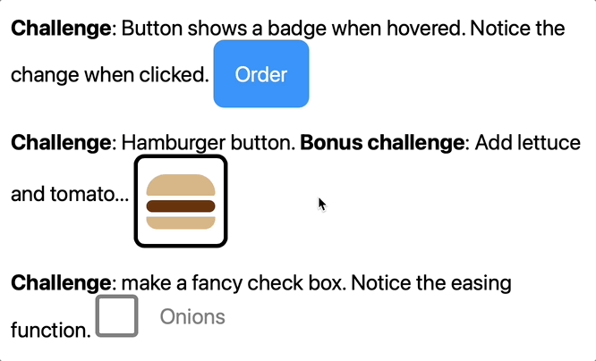

# transition-examples
 
These examples illustrate techniques with transition. 

Start with `example-1.html`. This file illustrates thes following ideas: 

- Using transition and applying timing functions. 
- Transition properties. 
- Transitioning child elements.
- Targeting the parent element. 

Read the comments and look for TODO items. Experiment with these. 

## Challenge problems

Examine the image below. Your goal is to recreate the examples shown here. 

- **Badge Button**, on hover the background changes color (dark blue), and the badge appears in the upper right. On active (mouse down) the background changes color (red) and the badge disappears. You should be able to do this with only the `<button>` element.
- **Hamburger button**, looks like a hamburger with two buns. On hover the buns fly away, and the burger fills the center of the box. To solve this you will most likely need three elements: top bun, burger, and bottom bun. 
- **Fancy checkbox**, color iis gray. When clicked, the color changes to black, and the box is filled with green, and the check mark flies up from below into the box. Notice you can click on the label! This means you should probably be using a label with a nested checkbox, with this arrangment, you need to use the "parent" selector. See the examples! 

Submit your solutions to Gradscope. 